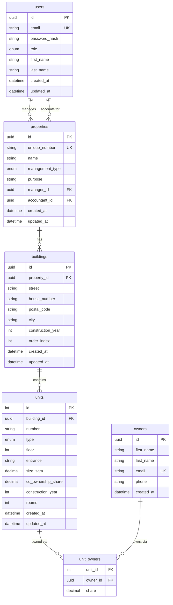

# Property Management Dashboard

This repository contains a full-stack property management prototype built with **Next.js (App Router)** and **NestJS**, using **PostgreSQL** as the database and **Prisma ORM** for data access.

The project demonstrates a clean and scalable approach to building a **Property Management Dashboard** with a **draft-based creation flow**, a **multi-step wizard**, and a clear **Property → Buildings → Units** domain model.

The main focus of the project is **architecture, data flow correctness, and predictable UX**, rather than visual polish or feature completeness.

---

## 📌 Project Goals

The primary goals of this project are:

- Design a clear and extensible **real estate domain model**
- Implement a **draft-first creation flow** for complex entities
- Build a **stable dashboard UI** with a multi-step wizard
- Avoid common frontend pitfalls:
  - silent form submit failures
  - hidden HTML validation bugs
  - unclear source-of-truth for data
- Demonstrate production-ready patterns in:
  - NestJS + Prisma
  - Next.js App Router
  - complex form workflows

---


## ✅ Use Cases

| # | Use Case | Status |
|---|----------|--------|
| 1 | List all properties | ✅ Implemented |
| 2 | View a single property by ID | ✅ Implemented |
| 3 | Create a new property | ✅ Implemented |
| 4 | Update a property | ✅ Implemented |
| 5 | Delete a property | ✅ Implemented |
| 6 | List all buildings for a property | ✅ Implemented |
| 7 | Add a building to a property | ✅ Implemented |
| 8 | List all owners with their units | ✅ Implemented |
| 9 | Create a new owner | ✅ Implemented |
| 10 | Assign an owner to a unit with a share | ✅ Implemented |
| 11 | View units for a specific unit | ✅ Implemented |
| 12 | View top owners by total area | ✅ Implemented |
| 13 | View unit area statistics | ✅ Implemented |
| 14 | API health check | ✅ Implemented |
| 15 | Unit CRUD (full) | ⏳ Not yet implemented |
| 16 | User authentication (JWT) | ⏳ Not yet implemented |


## 🧱 Domain Model
Property
├─ Buildings (1..n)
│   └─ Units (0..n)
│       └─ UnitOwners (0..n)  ← many-to-many join table
│           └─ Owners

### Property
Represents a managed real estate object.

- Has a management type (`WEG` or `MV`)
- Assigned to a manager and an accountant (both reference `users`)
- Stores business-level fields: name, purpose, unique number

### Building
Represents a physical building belonging to a property.

- Address-based entity (street, house number, city, postal code)
- Ordered within a property via `order_index`
- Acts as a parent for units

### Unit
Represents an individual unit (apartment, office, parking, garden, etc.).

- Belongs to exactly one building
- Has physical and legal attributes (size, floor, rooms, co-ownership share)
- Can be co-owned by multiple owners via `unit_owners`

### Owner
Represents a real person who owns one or more units.

- Linked to units via the `unit_owners` join table
- Each ownership record stores a `share` percentage

### UnitOwner (many-to-many)
Join table between `units` and `owners`.

- Composite primary key: `(unit_id, owner_id)`
- Stores the ownership share per unit per owner


---

## 🗄 Database Overview (PostgreSQL)

The database runs via **Docker** and is managed through **Prisma Migrations**.

### Properties Table
```sql
properties
- id (uuid, PK)
- unique_number (text, UNIQUE)
- name (text)
- management_type (enum: WEG | MV)  ← indexed
- purpose (text, nullable)
- manager_id (uuid, FK → users.id)  ← indexed
- accountant_id (uuid, FK → users.id) ← indexed
- teilungserklarung_file_path (text, nullable)
- created_at (timestamp)
- updated_at (timestamp)
```

### BuildingsTable
```sql
buildings
- id (uuid, PK)
- property_id (uuid, FK → properties.id) ← indexed, cascade delete
- street (text)
- house_number (text)
- postal_code (text, nullable)
- city (text, nullable)
- construction_year (int, nullable)
- order_index (int, default 0)
- created_at (timestamp)
- updated_at (timestamp)
```
### Units Table
```sql
units
- id (int, PK, autoincrement)
- building_id (uuid, FK → buildings.id) ← indexed, cascade delete
- number (text)
- type (enum: APARTMENT | OFFICE | GARDEN | PARKING) ← indexed
- floor (int, nullable)
- entrance (text, nullable)
- size_sqm (decimal 8.2, nullable)
- co_ownership_share (decimal 8.4)
- construction_year (int, nullable)
- rooms (int, nullable)
- created_at (timestamp)
- updated_at (timestamp)
- UNIQUE(building_id, number)
```
### Owners Table
```sql
owners
- id (uuid, PK)
- first_name (text)
- last_name (text)
- email (text, UNIQUE)
- phone (text, nullable)
- created_at (timestamp)
```
### UnitOwners Table (many-to-many)
```sql
unit_owners
- unit_id (int, FK → units.id)   ← composite PK, cascade delete
- owner_id (uuid, FK → owners.id) ← composite PK, indexed, cascade delete
- share (decimal 5.2)
```
### Users Table
```sql
users
- id (uuid, PK)
- email (text, UNIQUE)
- password_hash (text)
- role (enum: ADMIN | MANAGER | ACCOUNTANT)
- first_name (text, nullable)
- last_name (text, nullable)
- created_at (timestamp)
- updated_at (timestamp)
```
### Performance Indexes

| Index | Table | Purpose |
|-------|-------|---------|
| `properties_manager_id_idx` | properties | Filter/JOIN by manager |
| `properties_accountant_id_idx` | properties | Filter/JOIN by accountant |
| `properties_management_type_idx` | properties | Filter by WEG/MV |
| `buildings_property_id_idx` | buildings | JOIN buildings → properties |
| `units_building_id_idx` | units | JOIN units → buildings |
| `units_type_idx` | units | Filter by unit type |
| `unit_owners_owner_id_idx` | unit_owners | JOIN unit_owners → owners |

### Data

The database is seeded with realistic demo data via `seed.sql`:

| Table | Records |
|-------|---------|
| users | 4 |
| properties | 3 |
| buildings | 5 |
| units | 13 |
| owners | 8 |
| unit_owners | 10 |

Data was manually crafted to represent realistic German property management scenarios including co-owned units, mixed unit types, and multiple buildings per property.

## 🔑 Key Characteristics

This project is built around a set of deliberate architectural and UX decisions aimed at creating a stable and predictable system.

### Draft‑First Workflow
- Properties can exist in a `draft` state
- Drafts allow users to incrementally fill complex data
- No implicit activation — state transitions are explicit

### Single Source of Truth
- Core business fields (`name`, `managementType`, `manager`, `accountant`)
  are stored and read from the backend
- The UI never relies on hardcoded fallbacks once data is provided
- Prevents data divergence between frontend state and database

### Stable Form Handling
- Native HTML validation is fully disabled in wizard forms
- All validation is handled explicitly in JavaScript
- Eliminates silent submit failures in multi-step workflows

### Predictable Navigation
- Submit logic exists only in client components
- Redirects happen strictly after successful `await` of API calls
- No hidden side effects (`useEffect`, server actions, etc.)

### Intentional Scope Control
- No delete flow for properties (removed due to instability at this stage)
- No backend aggregation logic yet
- Focus is on correctness, not feature quantity

---

## 🛠 Tech Stack

### Frontend
- **Next.js (App Router)** — routing, layouts, and data fetching
- **React** — component-based UI
- **TypeScript** — strict typing across the app
- **Chakra UI v3** — accessible, composable UI components

### Backend
- **Node.js** — runtime
- **NestJS** — modular backend framework
- **PostgreSQL** — relational database
- **Prisma ORM** — type-safe database access
- **bcrypt** — password hashing

### Infrastructure
- **Docker / Docker Compose** — local database setup
- **Prisma Migrations** — schema versioning and consistency

---

## 🔧 Backend Architecture

The backend follows a **modular NestJS architecture** with a strong emphasis on
type safety and separation of concerns.

### Core Principles
- Each domain is isolated in its own module
- Prisma is injected via a dedicated `PrismaModule`
- DTOs are strictly separated from entities
- Enums are used consistently for domain concepts
### Backend Structure
```text
backend/
├─ prisma/
│  ├─ schema.prisma
│  ├─ migrations/
│  └─ generated/
├─ src/
│  ├─ app.module.ts
│  ├─ main.ts
│  ├─ prisma/
│  │  ├─ prisma.module.ts
│  │  └─ prisma.service.ts
│  ├─ database/
│  │  ├─ database.module.ts
│  │  └─ seed.sql
│  ├─ properties/
│  │  ├─ dto/
│  │  ├─ properties.controller.ts
│  │  ├─ properties.service.ts
│  │  └─ properties.module.ts
│  │  ├─ buildings/
│  │  ├─ buildings.controller.ts
│  │  └─ buildings.module.ts
│  ├─ owners/
│  │  ├─ dto/
│  │  ├─ owners.controller.ts
│  │  ├─ owners.service.ts
│  │  └─ owners.module.ts
│  ├─ users/
│  │  ├─ dto/
│  │  ├─ users.controller.ts
│  │  ├─ users.service.ts
│  │  └─ users.module.ts
│  └─ health/
│     ├─ health.controller.ts
│     └─ health.module.ts
└─ docker-compose.yml
```

## 🖥 Frontend Overview

The frontend is a **Next.js (App Router)** application responsible for
displaying the Property Dashboard and handling the property creation wizard.

Its main responsibilities are:
- displaying properties and their current state
- guiding the user through a multi-step creation flow
- sending validated data to the backend
- handling navigation and redirects

The frontend does not contain business logic or hidden state —
the backend is the single source of truth.

---

## 📁 Frontend Structure
```text
front/
├─ app/
│  ├─ dashboard/
│  │  ├─ page.tsx
│  │  └─ layout.tsx
│  ├─ properties/
│  │  ├─ create/
│  │  │  └─ page.tsx
│  │  └─ id/
│  │     └─ wizard/
│  │        └─ page.tsx
│  └─ layout.tsx
├─ components/
│  ├─ property/
│  │  ├─ PropertyList.tsx
│  │  ├─ PropertyListItem.tsx
│  │  ├─ PropertyDetailsDialog.tsx
│  │  └─ CreatePropertyButton.tsx
│  ├─ wizard/
│  │  ├─ WizardLayout.tsx
│  │  ├─ WizardForm.tsx
│  │  └─ steps/
│  │     ├─ GeneralInfoStep.tsx
│  │     ├─ BuildingsStep.tsx
│  │     └─ UnitsStep.tsx
│  └─ ui/
│     ├─ provider.tsx
│     ├─ toaster.tsx
│     └─ tooltip.tsx
├─ dto/
├─ models/
├─ services/
└─ public/
```

---

## ✅ What the Frontend Does

- Renders a **property dashboard** with card-based layout
- Displays property status (`draft` / `active`) and management type (`WEG` / `MV`)
- Opens a **property preview dialog** on card click
- Provides entry points to continue or complete a property wizard
- Implements a **multi-step property creation wizard**:
  1. General Info
  2. Buildings
  3. Units
- Validates and submits user input to the backend
- Redirects the user after successful operations

---

## ⚠️ Key Notes

- The frontend disables native HTML validation in wizard forms
- All submit logic runs in client components
- Redirects occur only after successful API calls
- No business logic or aggregation is handled on the frontend

The frontend is intentionally kept **simple, predictable, and stable**.

### Modules Overview

- **PropertiesModule**
  - Full CRUD for properties
  - Core business entity
- **BuildingsModule**
  - Buildings belonging to a property
  - Ordered within a property via `order_index`
- **OwnersModule**
  - Owner creation and listing
  - Assign owners to units with ownership share
  - Top owners by area and unit statistics
- **UsersModule**
  - Basic user management
  - Password hashing
- **PrismaModule**
  - Centralized Prisma client
- **DatabaseModule**
  - Database initialization and seeding
- **HealthModule**
  - Health check endpoint

### API Design

The backend exposes a simple REST API:
```text
# Health
GET    /api/health

# Properties
GET    /api/properties
POST   /api/properties
GET    /api/properties/:id
PATCH  /api/properties/:id
DELETE /api/properties/:id

# Buildings
GET    /api/properties/:propertyId/buildings
POST   /api/properties/:propertyId/buildings

# Owners
GET    /api/owners
POST   /api/owners
GET    /api/owners/top
GET    /api/owners/stats/area
POST   /api/owners/units/:unitId/assign
GET    /api/owners/units/:unitId
```


## ▶️ Local Development Setup

This section describes how to run the project locally for development.

---

### ✅ Prerequisites

Make sure the following tools are installed on your machine:

- **Node.js** `>= 18`
- **npm** or **yarn**
- **Docker**
- **Docker Compose**

---

### 🗄 1. Start PostgreSQL (Docker)

The project uses a local PostgreSQL database running in Docker.

From the root of the repository:
```bash
docker-compose up -d
```
## Backend Setup (NestJS + Prisma)

```bash
cd backend
```
Install dependencies:
```bash
npm install
```
Generate Prisma Client:
```bash
npx prisma generate
```
Run database migrations:
```bash
npx prisma migrate dev
```
(Optional) Seed the database with demo data:
```bash
psql < ./src/database/seed.sql
```
Start the backend in development mode:
```bash
npm run start:dev
```
Backend will be available at:
http://localhost:3000

## Frontend Setup (Next.js)
Open a new terminal and navigate to the frontend folder:
```bash
cd front
```
Install dependencies:
```bash
npm install
```
Start the frontend development server:
```bash
npm run dev
```
Frontend will be available at:
http://localhost:3001

🔍 Health Check
You can verify that the backend is running by opening:
``bash
GET http://localhost:3000/health
``
A successful response confirms that the API and database connection
are working correctly.
